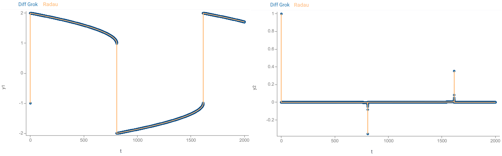
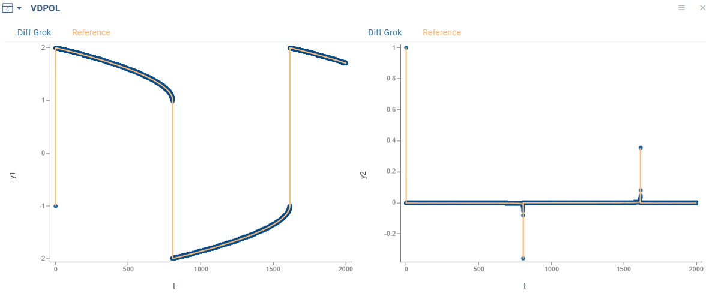
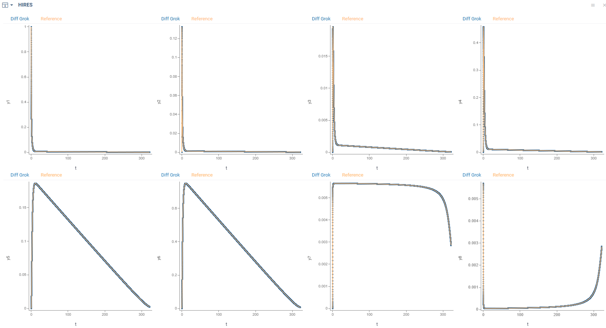

# Diff Grok

[](https://doi.org/10.5281/zenodo.17974378)
[](https://datagrok-ai.github.io/diff-grok/)
[](https://github.com/datagrok-ai/diff-grok/blob/main/LICENSE)
[](https://github.com/datagrok-ai/diff-grok/actions/workflows/libraries.yaml)
[](https://github.com/datagrok-ai/diff-grok/actions/workflows/test.yaml)

A lightweight TypeScript library for solving initial value problem ([IVP](https://en.wikipedia.org/wiki/Initial_value_problem)) for ordinary differential equations ([ODEs](https://en.wikipedia.org/wiki/Ordinary_differential_equation)) using numerical methods. This library focuses on solving [stiff equations](https://en.wikipedia.org/wiki/Stiff_equation).

## Features

* Solving both [stiff](https://en.wikipedia.org/wiki/Stiff_equation) and non-stiff equations
* Fast computations
* Implicit methods (for stiff ODEs) — Rosenbrock–Wanner type:
  * The modified Rosenbrock triple ([MRT](https://doi.org/10.1137/S1064827594276424))
  * The [ROS3PRw](https://doi.org/10.1016/j.cam.2015.03.010) method
  * The [ROS34PRw](https://doi.org/10.1016/j.cam.2015.03.010) method
* Explicit methods (for non-stiff ODEs):
  * The Runge-Kutta-Fehlberg 4(5) method ([RK4](https://en.wikipedia.org/wiki/Runge%E2%80%93Kutta_methods))
  * The Adams-Bashforth predictor-corrector method of order 5 ([AB5](https://en.wikipedia.org/wiki/Linear_multistep_method))
* Scripting:
  * declarative specification of models
  * auto-generated JavaScript code
* Integration with the [Datagrok](https://datagrok.ai) platform
* Zero dependencies

## Installation

To install via npm:

```bash
npm install diff-grok
```

Minimal "Hello World" example:

```typescript
// example.ts

import {ODEs, mrt} from 'diff-grok';

const task: ODEs = {
  name: 'Example',
  arg: {name: 't', start: 0, finish: 1, step: 0.1},
  initial: [1, -1],
  func: (t: number, y: Float64Array, output: Float64Array) => {
    out[0] = y[0] - t;
  },
  tolerance: 1e-7,
  solutionColNames: ['y(t)'],
};

const solution = mrt(task);

console.log('t:', solution[0]);
console.log('y(t):', solution[1]);
```

## Solving

### General

To find numerical solution of a problem:

$$\frac{dy}{dt} = f(t, y)$$
$$y(t_{0}) = y_0$$

on the segment $[t_0, t_1]$ with the step $h$:

1. Import `ODEs` and a desired numerical method:

   Implicit methods (for stiff ODEs):
   * `mrt` - the [MRT](https://doi.org/10.1137/S1064827594276424) method
   * `ros3prw`- the [ROS3PRw](https://doi.org/10.1016/j.cam.2015.03.010) method
   * `ros34prw` - the [ROS34PRw](https://doi.org/10.1016/j.cam.2015.03.010) method

   Explicit methods (for non-stiff ODEs):
   * `rk4` - the Runge-Kutta-Fehlberg 4(5) method
   * `ab5` - the Adams-Bashforth-Moulton predictor-corrector method of order 5

2. Specify `ODEs` object that defines a problem:

   * `name` - name of a model
   * `arg` - independent variable specification. This is in object with fields:
     * `name` - name of the argument, $t$
     * `start` - initial value of the argument, $t_0$
     * `finish` - final value of the argument, $t_1$
     * `step` - solution grid step, $h$
   * `initial` - initial values, $y_0$
   * `func` - right-hand side of the system, $f(t, y)$. This is a function `(t: number, y: Float64Array, output: Float64Array) => void`:
     * `t` - value of independent variable $t$
     * `y` - values of $y$
     * `output` - output values of $f(t, y)$

   * `tolerance` - numerical tolerance
   * `solutionColNames` - names of solutions, i.e. names of the vector $y$ elements

3. Call numerical method. It returns `Float64Array`-arrays with values of an argument and approximate solutions.

Diff Grok is designed to provide fast computations. Check [performance](#performance) for the details.

### Example

Consider the following problem:

$$\begin{cases}
\frac{dx}{dt} = x + y - t \\
\frac{dy}{dt} = x y + t \\
x(0) = 1 \\
y(0) = -1
\end{cases}$$

To solve it on the segment $[0, 2]$ with the step $0.01$ using the [MRT](https://doi.org/10.1137/S1064827594276424) method with the tolerance $10^{-7}$, we start with imports:

```typescript
import {ODEs, mrt} from 'diff-grok';
```

Next, we create

```typescript
const task: ODEs = {
    name: 'Example', // name of your model
    arg: {
        name: 't',  // name of the argument
        start: 0,   // initial value of the argument
        finish: 2,  // final value of the argument
        step: 0.01, // solution grid step
    },
    initial: [1, -1], // initial values
    func: (t: number, y: Float64Array, output: Float64Array) => { // right-hand side of the system
      output[0] = y[0] + y[1] - t; // 1-st equation
      output[1] = y[0] * y[1] + t; // 2-nd equation
    },
    tolerance: 1e-7, // tolerance
    solutionColNames: ['x', 'y'], // names of solution functions
};
```

Finally, we call the specified numerical method to solve `task`:

```typescript
const solution = mrt(task);
```

Currently, `solution` contains:

* `solution[0]` - values of $t$, i.e. the range $0..2$ with the step $0.01$
* `solution[1]` - values of $x(t)$ at the points of this range
* `solution[2]` - values of $y(t)$ at the points of the same range

Find this example in [basic-use.ts](./src/examples/basic-use.ts).

## Performance

The following [classic problems](https://archimede.uniba.it/~testset/testsetivpsolvers/?page_id=26#ODE) are used to evaluate efficiency of Diff Grok methods:

* [Rober](https://archimede.uniba.it/~testset/report/rober.pdf)
  * a stiff system of 3 nonlinear ODEs
  * describes the kinetics of an autocatalytic reaction given by Robertson
  * [robertson.ts](./src/examples/robertson.ts)
* [HIRES](https://archimede.uniba.it/~testset/report/hires.pdf)
  * a stiff system of 8 non-linear equations
  * explains the `High Irradiance Responses' (HIRES) of photomorphogenesis on the basis of phytochrome, by means of a chemical reaction   involving eight reactants
  * [hires.ts](./src/examples/hires.ts)
* [VDPOL](https://archimede.uniba.it/~testset/report/vdpol.pdf)
  * a system of 2 ODEs proposed by B. van der Pol
  * describes the behaviour of nonlinear vacuum tube circuits
  * [vdpol.ts](./src/examples/vdpol.ts)
* [OREGO](https://archimede.uniba.it/~testset/report/orego.pdf)
  * a stiff system of 3 non-linear equations
  * simulates Belousov-Zhabotinskii reaction
  * [orego.ts](./src/examples/orego.ts)
* [E5](https://archimede.uniba.it/~testset/report/e5.pdf)
  * a stiff system of 4 non-linear ODEs
  * represents a chemical pyrolysis model
  * [e5.ts](./src/examples/e5.ts)
* [Pollution](https://archimede.uniba.it/~testset/report/pollu.pdf)
  * a stiff system of 20 non-linear equations
  * describes a chemical reaction part of the air pollution model designed at The Dutch National Institute of Public Health and Environmental Protection
  * [pollution.ts](./src/examples/pollution.ts)

The MRT, ROS3PRw and ROS34PRw methods demonstrate the following time performance (AMD Ryzen 5 5600H 3.30 GHz CPU):

|Problem|Segment|Points|Tolerance|MRT, ms|ROS3PRw, ms|ROS34PRw, ms|
|-|-|-|-|-|-|-|
|[Rober](https://archimede.uniba.it/~testset/report/rober.pdf)|[0, 10E+11]|40K|1E-7|103|446|285|
|[HIRES](https://archimede.uniba.it/~testset/report/hires.pdf)|[0, 321.8122]|32K|1E-10|222|362|215|
|[VDPOL](https://archimede.uniba.it/~testset/report/vdpol.pdf)|[0, 2000]|20K|1E-12|963|1576|760|
|[OREGO](https://archimede.uniba.it/~testset/report/orego.pdf)|[0, 360]|36K|1E-8|381|483|199|
|[E5](https://archimede.uniba.it/~testset/report/e5.pdf)|[0, 10E+13]|40K|1E-6|14|17|8|
|[Pollution](https://archimede.uniba.it/~testset/report/pollu.pdf)|[0, 60]|30K|1E-6|36|50|23|

Maximum absolute deviations (MADs) from the reference solutions obtained using SciPy (Radau) are summarized in the table below:

|Problem|MRT|ROS3PRw|ROS34PRw|
|-|-|-|-|
|[Rober](https://archimede.uniba.it/~testset/report/rober.pdf)|1.87e-8|1.88e-8|1.88e-8|
|[HIRES](https://archimede.uniba.it/~testset/report/hires.pdf)|4.80e-11|1.05e-14|2.87e-14|
|[VDPOL](https://archimede.uniba.it/~testset/report/vdpol.pdf)|5.12e-4|5.12e-4|5.12e-4|
|[OREGO](https://archimede.uniba.it/~testset/report/orego.pdf)|3.05e-5|3.45e-7|2.31e-6|
|[E5](https://archimede.uniba.it/~testset/report/e5.pdf)|1.12e-19| 1.33e-19|3.40e-17|
|[Pollution](https://archimede.uniba.it/~testset/report/pollu.pdf)|4.06e-10|9.16e-12|1.58e-10|

Run [check-methods.ts](./src/examples/check-methods.ts) to reproduce these results (see [here](#examples) how to run scripts standalone).

The following charts compare the Diff Grok and Radau solutions for the **van der Pol** system:



The following graphs present a comparison of the Diff Grok and Radau solutions for the **Pollution** model, highlighting a portion of the functions:


<details>
<summary><strong>Gallery</strong></summary>

**VDPOL**



**HIRES**



**E5**


**POLL**


**OREGO**


**Rober**


</details>

<details>
<summary><strong>Run benchmarks</strong></summary>

Run benchmark models and find the reference solutions via the following links to the [Datagrok](https://public.datagrok.ai) platform:

|Problem|Diff Grok|Radau|
|-|-|-|
|Rober|[ROBER.ivp](https://public.datagrok.ai/file/System.AppData/DiffStudio/benchmarks/ROBER.ivp)|[ROBER.csv](https://public.datagrok.ai/file/System.AppData/DiffStudio/benchmarks/ROBER-using-Radau.csv?browse=files)|
|HIRES|[HIRES.ivp](https://public.datagrok.ai/file/System.AppData/DiffStudio/benchmarks/HIRES.ivp)|[HIRES.csv](https://public.datagrok.ai/file/System.AppData/DiffStudio/benchmarks/HIRES-using-Radau.csv?browse=files)|
|VDPOL|[VDPOL.ivp](https://public.datagrok.ai/file/System.AppData/DiffStudio/benchmarks/VDPOL.ivp)|[VDPOL.csv](https://public.datagrok.ai/file/System.AppData/DiffStudio/benchmarks/VANDERPOL-using-Radau.csv?browse=files)|
|OREGO|[OREGO.ivp](https://public.datagrok.ai/file/System.AppData/DiffStudio/benchmarks/OREGO.ivp)|[OREGO.csv](https://public.datagrok.ai/file/System.AppData/DiffStudio/benchmarks/OREGO-using-Radau.csv?browse=files)|
|E5|[E5.ivp](https://public.datagrok.ai/file/System.AppData/DiffStudio/benchmarks/E5.ivp)|[E5.csv](https://public.datagrok.ai/file/System.AppData/DiffStudio/benchmarks/E5-using-Radau.csv?browse=files)|
|Pollution|[POLL.ivp](https://public.datagrok.ai/file/System.AppData/DiffStudio/benchmarks/POLL.ivp)|[POLL.csv](https://public.datagrok.ai/file/System.AppData/DiffStudio/benchmarks/POLL-using-Radau.csv?browse=files)|

In the file [print-benchmark.ts](./src/examples/print-benchmark.ts), you can find standalone functions that print the solutions of these problems to the console, as well as Python scripts for computing the solutions using SciPy.

</details>

## Scripting

The library provides tools for declarative specifying models defined by IVPs. This feature enables a development of "no-code" modeling tools seamlessly integrated with the [Datagrok](https://datagrok.ai) platform.

### Model components and syntax

Each **model** has a simple declarative syntax.

#### Core blocks

These blocks define the basic mathematical model and are required for any model:

1. `#name`: Add a model identifier

   ```python
   #name: Problem
   ```

1. `#equations`: Define the system of ODEs to solve. Diff Grok supports any number of equations with single or multi-letter variable names
  
   ```python
   #equations:
     dx/dt = x + y + exp(t)
     dy/dt = x - y - cos(t)
   ```

1. `#argument`: Defines
   * independent variable
   * its initial value (`initial`)
   * final value (`final`), and
   * grid step (`step`)

   The solver calculates values at each step interval across the specified [_initial,final_] range.

   ```python
   #argument: t
     initial = 0
     final = 1
     step = 0.01
   ```

1. `#inits`: Defines initial values for functions being solved

   ```python
   #inits:
     x = 2
     y = 5
   ```

#### Comments

* `#comment`: Write a comment in any place of your model

   ```python
   #comment:
     You can provide any text here. The lib ignores it.
   ```

* Place comments right in formulas using `//`

   ```python
   #equations:
     dx/dt = x + y + exp(t) // 1-st equation
     dy/dt = x - y - cos(t) // 2-nd equation
   ```

#### Model parameters

These blocks define values used in equations. Choose type based on intended use:

* `#parameters`: Generate UI controls for model exploration

   ```python
   #parameters:
     P1 = 1
     P2 = -1

   ```

* `#constants`: Use for fixed values in equations that don't require UI controls

   ```python
   #constants:
     C1 = 1
     C2 = 3
   ```

#### Auxiliary calculations

This block defines mathematical functions using `#parameters`, `#constants`,
`#argument`, and other functions. These are direct calculations (no ODEs involved). Use them to break
down complex calculations and simplify your equations.

* `#expressions`

   ```python
   #expressions:
     E1 = C1 * t + P1
     E2 = C2 * cos(2 * t) + P2
   ```

### JS-code generation

To transform any model to JavaScript code with an appropriate specification of `ODEs` object, follow the steps:

1. Import the parsing and code generating tools:

```typescript
import {getIVP, getJScode} from 'diff-grok';
```

2. Define a string with a model specification, use a simple [model syntax](#model-components-and-syntax):

```typescript
const model = `
#name: Example
#equations:
  dx/dt = x + y - cos(t)
  dy/dt = x - y + sin(t)
...
`;
```

3. Parse formulas:

```typescript
const ivp = getIVP(model);
```

The method `getIVP` parses formulas and returns `IVP` object specifying a model.

4. Generate JS-code:

```typescript
const lines = getJScode(ivp);
```

The method `getJScode` transforms `IVP` object to JavaScript code. It returns an array of strings with this code.

Find this example in [scripting.ts](./src/examples/scripting.ts).

### Pipelines

Diff Grok **pipeline** is a powerful feature for complex process simulation and model analysis in webworkers. It wraps the main solver with a set of actions that perform pre- and post-processing of a model inputs & outputs. In addition, they provide an output customization.

1. Start with imports:

```typescript
import * as DGL from 'diff-grok';
```

2. Define your model:

```typescript
const model = `#name: My model
#equations:
  dx/dt = ...
  dy/dt = ...
  ...

#inits:
  x = 2
  y = 3
  ...
```

3. Generate IVP-objects:

* for the main thread computations:

```typescript
const ivp = DGL.getIVP(model);
```

* for computations in workers:
```typescript
const ivpWW = DGL.getIvp2WebWorker(ivp);
```

4. Set model inputs:

```typescript
const inputs = {
  x: 2,
  y: 30,
  ...
};
```

5. Create typed input array:

```typescript
const inputVector = DGL.getInputVector(inputs, ivp);
```

6. Get a pipeline:

```typescript
const creator = DGL.getPipelineCreator(ivp);
const pipeline = creator.getPipeline(inputVector);
```

You can pass `pipeline`, `ivpWW`, and `inputVector` to webworkers.

7. Apply pipeline to perform computations:

```typescript
const solution = DGL.applyPipeline(pipeline, ivpWW, inputVector);
```

Find complete examples in these files:

* [pipeline-use.ts](./src/examples/pipeline-use.ts) - A basic example demonstrating pipeline usage
* [model-updates.ts](./src/examples/model-updates.ts) - A simulation of a multi-stage process using pipelines
* [cyclic-model.ts](./src/examples/cyclic-model.ts) - A simulation of a cyclic process using pipelines

## Integration with Datagrok

[Datagrok](https://datagrok.ai) is a platform enabling powerful scientific computing capabilities. It provides next-generation environment for leveraging interactive visualizations, data access, machine learning, and enterprise features to enable developing, publishing, discovering, and using scientific applications.

The library is seamlessly integrated to Datagrok via the [Diff Studio](https://github.com/datagrok-ai/public/tree/master/packages/DiffStudio) package. It provides

* Numerical solving IVPs directly in the browser
* "No-code" models development
* Solving both stiff and non-stiff systems of ODEs
* Automatic generation of user interfaces
* Interactive visualization and model exploration
* Sensitivity analysis and parameters optimization
* Sharing models and computational results

Run the Diff Studio [app](https://public.datagrok.ai/apps/DiffStudio) and check interactive modeling:


Learn more

 * Diff Studio application [docs](https://datagrok.ai/help/compute/diff-studio)
 * Diff Studio example [models](https://datagrok.ai/help/compute/models)
 * [Parameters optimization](https://datagrok.ai/help/compute/function-analysis#parameter-optimization)
 * [Sensitivity analysis](https://datagrok.ai/help/compute/function-analysis#sensitivity-analysis)

## Environment Requirements

### Development & Build

* **Node.js ≥ 19.3.0** (required for development and building the library)
* **npm** or **yarn** package manager

### Runtime Environments

#### Server-Side (Node.js)

* **Node.js ≥ 16.0.0** (for server-side usage)
  * Requires support for ES modules
  * `Float64Array` and typed arrays support (available since Node.js 0.10+)

#### Operating Systems

* Windows (x64, ARM64)
* macOS (Intel & Apple Silicon)
* Linux (most common distributions)

#### Browser Support

The library runs in all modern browsers with ES2015+ support. Key requirements:

* **ES Modules** (native `import`/`export`)
* **Typed Arrays** (`Float64Array`, `Uint8Array`)
* **WebWorkers** (for pipeline computations)
* **ArrayBuffer** support

| Browser                | Minimum Version | Supported? | Notes                                           |
| ---------------------- | --------------- | ---------- | ----------------------------------------------- |
| **Chrome**             | 63+             | ✔️ Yes      | Full ES2015+ and WebWorker support              |
| **Firefox**            | 60+             | ✔️ Yes      | Full ES2015+ and WebWorker support              |
| **Safari (macOS/iOS)** | 11.1+           | ✔️ Yes      | Native ES module and WebWorker support          |
| **Edge (Chromium)**    | 79+             | ✔️ Yes      | Same support level as Chrome                    |
| **Opera**              | 50+             | ✔️ Yes      | Chromium-based, full support                    |
| **Legacy Browsers**    | -               | ❌ No       | IE 11, pre-Chromium Edge, old Android browsers  |

**Browser Feature Requirements:**
* ES2015 (ES6) JavaScript support
* Native ES modules (`<script type="module">`)
* `Float64Array` and other typed arrays
* `WebWorker` API (for parallel computations)
* `Promise` support
* `Math` object with standard functions (`exp`, `sin`, `cos`, etc.)

**Notes:**
* For older browsers, consider using a transpiler (Babel) and bundler (Webpack/Rollup)
* TypeScript compilation target should be ES2015 or higher
* WebWorker support is required for pipeline computations; without it, computations run on the main thread

### Bundler Configuration

When bundling for browsers, ensure:
* ES module output format is preserved or properly transformed
* TypedArray polyfills are not included (not needed for target browsers)
* WebWorker files are properly handled by your bundler

### Polyfills

No polyfills required for target environments. All required features are natively supported in the minimum browser versions listed above.

## Examples

Diff Grok contains a set of examples located in the folder [src/examples](./src/examples/):

|File|Features|
|-|-|
|[basic-use.ts](./src/examples/basic-use.ts)|Minimal "Hello World" example. Illustrates the use of the [MRT](https://doi.org/10.1137/S1064827594276424) method.|
|[check-methods.ts](./src/examples/check-methods.ts)| Checks the [performance](#performance) of numerical methods.|
|[corr-probs.ts](./src/examples/corr-probs.ts)|Solves a set of problems with exact solutions and evaluate the deviation.|
|[cyclic-model.ts](./src/examples/cyclic-model.ts)| Considers pharmacokinetic-pharmacodynamic (PK-PD) simulation and shows how to apply pipelines and cyclic models.|
|[model-updates.ts](./src/examples/model-updates.ts)|Considers gluconic acid (GA) production by Aspergillus niger modeling and shows how to apply pipelines and models with updates.|
|[pipeline-use.ts](./src/examples/pipeline-use.ts)|Considers modeling queues and shows shows how to apply pipelines and models with customized outputs.|
|[scripting.ts](./src/examples/scripting.ts)|Shows how to generate JS-script from Diff Grok model.|

<details>
<summary><strong>Run examples</strong></summary>

To run examples standalone:

1. Install TypeScript locally. If your project does not already include TypeScript:
```bash
npm install --save-dev typescript
```

2. Create a tsconfig.json. If you do not have one yet:
```bash
npx tsc --init
```
Recommended configuration:
```json
{
  "compilerOptions": {
    "target": "es6",
    "lib": ["ES2022", "dom"],
    "sourceMap": true,
    "strict": true,
    "moduleResolution": "node",
    "types": ["jest", "node"],
    "esModuleInterop": true,
    "skipLibCheck": true,
  }
}
```

3. Compile the TypeScript file:
```bash
tsc src/examples/basic-use.ts
```

4. Run:
```bash
node src/examples/basic-use.js
```

</details>

## Contributing

We welcome contributions of all kinds - bug reports, feature requests, documentation updates, and pull requests.

Before contributing, please read our [Contributing Guidelines](./CONTRIBUTING.md).
