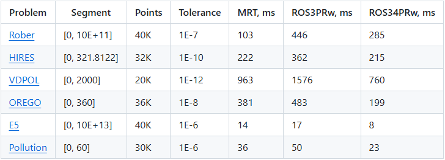
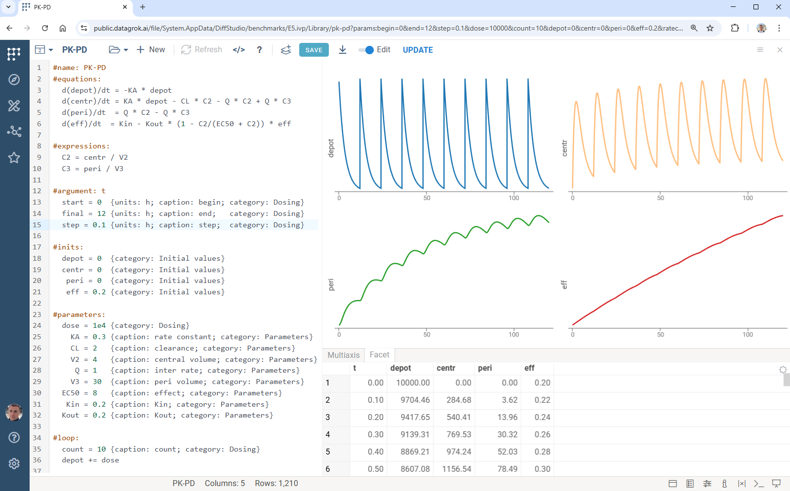
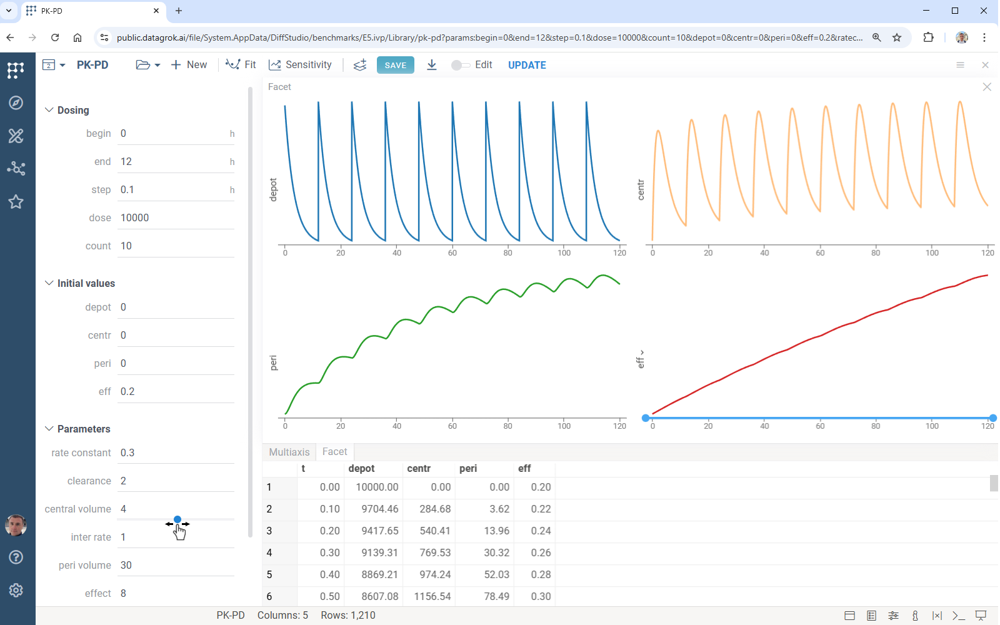

# Summary

Ordinary differential equations (ODEs), typically formulated as initial value problems (IVPs), are widely used to model the dynamics of complex systems. They are utilized in many domains, including physical processes [@chicone2006ordinary], biochemical kinetics [@ingalls2013mathematical], drug delivery systems [@mircioiu2019mathematical], cloud computing [@jafarnejad2019applying], and population dynamics [@hastings2013population].

While a broad ecosystem of mature numerical solvers exists, effective **interactive exploration**, **reproducible computation**, and **collaborative model development** remain difficult to achieve - particularly in browser-based environments. Most existing tools are designed around desktop or scripting workflows and provide limited support for real-time interaction, model sharing, or collaborative analysis.

Diff Studio is a **browser-native environment for solving and exploring IVPs**, designed to support interactive, collaborative, and reproducible ODE modeling without custom software development or local environment setup. It enables users to define models declaratively, explore their behavior interactively, and share fully reproducible simulations through the browser.

Diff Studio consists of two components:
1. **Diff Grok**:  general-purpose high-performance TypeScript library for solving ODE systems defined in a declarative form
2. **Diff Studio**: web application that integrates Diff Grok into the **Datagrok** scientific computing platform. It provides autogenerated user interface, rich interactive visualizations, and the ability to manage ODE models and simulations.

# Statement of need

ODEs can be solved either analytically or numerically. Analytic methods provide exact solutions but apply only to limited classes of problems and are often impractical due to their complexity [@hairer2008solving1]. Numerical methods, which compute approximate solutions, are therefore the dominant approach. A wide range of such methods has been developed [@hairer2008solving1; @hairer2002solving2] and is available in established scientific computing tools, including SUNDIALS [@gardner2022sundials; @hindmarsh2005sundials], Julia DifferentialEquations [@rackauckas2017differentialequations], SciPy [@2020SciPyNMeth], Maple [@maple2025], Mathematica [@Mathematica2024], Matlab [@MATLAB], and deSolve [@soetaert2010solving].

These tools provide robust and efficient solvers but are primarily designed for **desktop or scripting-centric workflows**. In practice, scientific modeling is often exploratory: researchers iteratively adjust parameters, inspect transient behavior, compare scenarios, and refine model structure. Collaboration across teams and institutions is also common. Existing solutions typically require local installation, environment configuration, and custom scripting, which complicates sharing models and reproducing results. Building interactive analysis tools on top of these systems often requires substantial additional programming effort, shifting focus away from scientific inquiry toward software engineering.

Diff Studio addresses these limitations by providing a **browser-native**, **interactive modeling environment** that combines numerical performance with ease of use. It supports low-code model definition, immediate visual feedback, and seamless sharing of fully reproducible simulations via the web.

# The solution: Diff Studio

Delivering high-performance ODE modeling in the browser introduces additional technical challenges. Approaches based on WebAssembly [@wasm2025] or Pyodide [@pyodide2025] enable reuse of existing numerical libraries but impose important trade-offs. WebAssembly offers near-native performance for code written in C/C++ or Rust, but typically requires recompilation when equations or model structure change, limiting flexibility during iterative model design. Pyodide provides a WebAssembly-based Python environment that supports NumPy and SciPy but incurs large download sizes, potential performance overhead, and less seamless integration with browser APIs and reactive user interfaces.

In contrast, pure JavaScript and TypeScript solutions integrate naturally with the browser execution model and user interface frameworks. However, existing libraries such as Math.js [@mathjs] and odex-js [@odexjs] expose low-level APIs and generally require programming expertise from end users.

Diff Studio adopts a TypeScript-native approach combined with declarative modeling to eliminate the need for programming expertise while preserving performance and flexibility. Its core numerical engine, Diff Grok, provides:

* **Solving tools**: A collection of numerical methods. Diff Grok implements the modified Rosenbrock triple (MRT) [@Shampine1997], ROS3PRw [@jax2021], and ROS34PRw [@rang2015improved] methods, supporting both stiff and non-stiff systems. Performance was benchmarked on standard test problems including Robertson [@robertson1966solution], HIRES [@schafer1975new], VDPOL [@vanderpol1926relaxation], OREGO [@hairer2002solving2], E5 [@hairer2002solving2], and Pollution [@verwer1994gauss]. The results demonstrate near-real-time performance suitable for interactive exploration (see \autoref{fig:performance}).

* **Computational pipelines**: Support for multi-stage modeling and solving workflows executed in web workers, enabling parallel computation. These pipelines are used for parameter optimization and sensitivity analysis directly in the browser.

* **Declarative modeling language**: A domain-specific language for specifying IVPs as text, including equations and annotated model inputs. This representation supports automatic interface generation.

Diff Studio integrates Diff Grok into the Datagrok platform, providing a complete web application for ODE modeling. It includes an equations editor (\autoref{fig:dseditor}), an autogenerated interactive user interface (\autoref{fig:autoui}), and rich visualization capabilities.

A defining feature of Diff Studio is its real-time interactivity. Whenever a user adjusts a parameter or moves a slider, the system automatically recomputes the solution and updates all visualizations. Diff Grok enables these updates to occur almost instantaneously, supporting rapid hypothesis testing and intuitive exploration of model behavior.

Diff Studio also emphasizes reproducibility and collaboration. Models, parameter settings, and results can be shared via URLs, allowing collaborators to reproduce simulations without installing software or configuring environments. Shared models remain fully interactive, enabling continued exploration and comparison.

Beyond basic simulation, Datagrok provides built-in sensitivity analysis and parameter optimization, allowing users to study parameter influence and fit models to data. Together, these capabilities position Diff Studio as a centralized, browser-based hub for ODE-driven modeling, exploration, and collaboration.

## Availability

* Diff Grok: [https://github.com/datagrok-ai/diff-grok](https://github.com/datagrok-ai/diff-grok)
* Diff Studio: [https://github.com/datagrok-ai/public/tree/master/packages/DiffStudio](https://github.com/datagrok-ai/public/tree/master/packages/DiffStudio)
* Run Diff Studio online: [https://public.datagrok.ai/apps/DiffStudio](https://public.datagrok.ai/apps/DiffStudio)
* Interactive tutorial: [https://public.datagrok.ai/apps/tutorials/Tutorials/Scientificcomputing/Differentialequations](https://public.datagrok.ai/apps/tutorials/Tutorials/Scientificcomputing/Differentialequations)

# Acknowledgements

The authors thank the entire **Datagrok** team and the **JnJ ModelHub** project team for their contributions and feedback, which significantly improved this work.

# Conflicts of interest

The authors declare no conflict of interest.

# References
