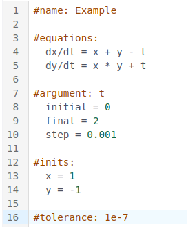

# Summary

Differential equations play a crucial role in modeling complex systems and phenomena, 
with applications ranging from pharmacology and drug manufacturing 
to financial modeling and environmental studies.

**Diff Studio** is a high performant TypeScript application 
for solving initial value problems in ordinary differential equations (ODEs)
directly within web browsers. 
It enables users without programming expertise to declaratively define models 
using a simple domain-specific language 
and provides real-time solution visualization,
syntax highlighting, and error detection. 

**Diff Studio** consists of two components. 
The **Diff Grok** (https://github.com/datagrok-ai/DiffGrok) library
implements numerical methods and formula parsing tools. 
The **Diff Studio** application (https://datagrok.ai/help/compute/diff-studio)
integrates Diff Grok tools with 
**Datagrok** (https://datagrok.ai/), 
a next-generation scientific computing platform.

Diff Studio created inside Datagrok an ecosystem
for rapid development of specialized scientific applications based on ODE models, 
and democratizes research by acting as a central repository for ODE models 
and guaranteeing the reproducibility and accessibility of results.

# Statement of need

Scientific modeling of complex processes and phenomena relies heavily on
ordinary differential equations. 
Their applications span diverse fields,
including physical processes [@chicone2006ordinary], 
biochemical kinetics [@ingalls2013mathematical], 
drug delivery systems [@mircioiu2019mathematical], 
cloud computing [@jafarnejad2019applying], 
and population dynamics [@hastings2013population].

Analytic methods providing exact solutions
can be applied only to a limited class of ODEs. 
Moreover, in many cases, the use of analytic
solutions proves impractical due to their complexity [@hairer2008solving1].
Numerical methods computing approximate solutions
are often preferred.

Numerous methods for solving ODEs have been recently developed 
[@hairer2008solving1; @hairer2002solving2]. 
These methods have been implemented in various software tools, 
including libraries and packages for programming languages and
scientific computing environments. 
Notable examples include 
SUNDIALS [@gardner2022sundials; @hindmarsh2005sundials], 
Julia Differential Equations package [@rackauckas2017differentialequations], 
SciPy [@2020SciPyNMeth], 
Maple [@maple2025], 
Mathematica [@Mathematica2024],
Matlab [@MATLAB], 
and deSolve [@soetaert2010solving].

Though most existing tools require significant technical expertise,
shifting emphasis from applied research to software development. 
The goal of this project is to develop an ecosystem 
providing comprehensive capabilities for in-browser ODE modeling and analysis.

# The solution: Diff Studio

We introduce **Diff Studio** – 
a TypeScript-based application 
allowing rapid in-browser ODE modeling and analysis for users 
without significant experience in software development.
Diff Studio facilitates rapid development of scientific applications
defined by ODEs. 
It enables the efficient design of complex processes
and phenomena simulators with a user-friendly interface.

The key features of **Diff Studio** include:

- Numerical solving of initial value problems for systems of ODEs directly in web-browser;
- Declarative problem specification implementing a "no-code" approach;
- Solving both stiff and non-stiff ODE systems;
- Automatic generation of user interfaces;
- Interactive visualization and model exploration tools;
- Sensitivity analysis and parameter optimization functionality;
- Automatic creation of standalone applications directly from ODE’s system;
- Sharing models and computational results;

The project architecture comprises two main components:

- The **Diff Grok** [@diffgrok] library provides numerical methods and 
  automatic generation of JavaScript code from declarative problem specification.

- The **DiffStudio** [@diffstudio] package, is a production-ready modeling environment integrated
  within the [@datagrok], scientific computing platform.

## Diff Grok library

The Diff Grok library (DG-lib) consists of two main components:

- **Solving tools:** numerical methods providing approximate solutions
  of Initial Value Problems (IVPs);
- **Scripting tools:** methods for automatic generation of JavaScript
  code that solves problems specified in the declarative form.

### Solving tools

Solving tools incorporate the following numerical methods:

- `mrt` - Modified Rosenbrock triple (MRT) [@Shampine1997]
- `ros3prw` - the ROS3PRw method [@jax2021]
- `ros34prw` - the ROS34PRw method [@rang2015improved]

To solve
\begin{equation}\label{eq:diffeq}
\begin{split}
dy/dt = f(t, y), \\
y(t_0) = y_0
\end{split}
\end{equation}

on the interval $[t0, t1]$, 
define an ODEs object. 
This object specifies the independent variable ($t$), 
its range ($[t0, t1]$), 
solution grid step size ($h$), 
initial conditions ($y0$),
right-hand side of the ODEs, 
tolerance, 
and names of dependent variables. 
Next, apply a selected method (`mrt`, `ros3prw` or `ros34prw`) 
to this object. 
The output consists of a list of `float64`
arrays containing the values of the independent variable and the
corresponding approximate solutions.

For example, consider
\begin{equation}\label{eq:ivp}
\begin{split}
dx/dt = x + y - t, \\
dy/dt = xy + t \\
x(0) = 1, y(0) = -1 \\
t \in [0, 2], h = 0.001
\end{split}
\end{equation}

In this case, the ODEs object is defined as follows:

```javascript
const task: ODEs = {
    name: 'Example',
    arg: {
        name: 't',
        start: 0,
        finish: 2,
        step: 0.001,
    },
    initial: [1, -1],
    func: (t: number, y: Float64Array, output: Float64Array) => {
        output[0] = y[0] + y[1] - t;
        output[1] = y[0] * y[1] + t;
    },
    tolerance: 1e-7,
    solutionColNames: ['x', 'y'],
};
```

The following code solves the given problem:
```javascript
const solution = mrt(task);
```

The solution contains three items:

- `solution[0]` - values of `t`, i.e. the range `0..2` with the step `0.001`;
- `solution[1]` - values of `x(t)` at the points of this range;
- `solution[2]` - values of `y(t)` at the same points.

The **Diff Grok** library demonstrates outstanding computational performance. 
The subsequent section presents a performance analysis based on solving a
set of classical benchmark problems.

### Scripting tools

Scripting tools enable specification of IVPs in a declarative form
known as the _Diff Studio model_ (DS-model), 
which employs an intuitive block-structured syntax. 
For example, the problem defined in \autoref{eq:ivp} can be
expressed as shown on the \autoref{fig:ivp}.

{ width=50% }

The method `getIVP()` parses DS-model and produces the IVP
object specifying the problem. 
If a model contains invalid expressions, an error is raised. 
The method `getJScode()` generates JavaScript code,
involving an appropriate ODEs object, that can be applied for
**in-browser** solving differential equations. 
Besides, an intermediate
IVP object can be used for the automatic creation of user interfaces. 

### Performance

DG-lib ensures efficient integration of both stiff and non-stiff ODEs. 
The **Table 1** compares the computational performance of `MRT`, `ROS3PRw`, and
`ROS34PRw` in solving these problems.
To evaluate performance, we employ the following collection of classical
benchmark problems:

- **Robertson:** A stiff system describing the kinetics of an
  autocatalytic reaction [@robertson1966solution];
- **HIRES:** A stiff system explaining photomorphogenesis phytochrome
  responses through a chemical reaction involving eight reactants 
  [@schafer1975new];
- **VDPOL:** A system of ODEs describing nonlinear vacuum tube circuit
  behavior [@vanderpol1926relaxation];
- **OREGO:** A stiff system simulating the Belousov-Zhabotinskii
  reaction [@hairer2002solving2];
- **E5:** A stiff system of nonlinear ODEs representing a chemical
  pyrolysis model [@hairer2002solving2];
- **Pollution:** A stiff system of nonlinear equations describing
  chemical reactions in an air pollution model developed at the Dutch
  National Institute of Public Health and Environmental Protection
  [@verwer1994gauss].

**Table 1.** Computational time comparison: MRT vs. ROS3PRw vs.
ROS34PRw on AMD Ryzen 5 5600H 3.30 GHz CPU \label{table:performance}

|  Problem  | Equations |     Segment     | Points | Tolerance | MRT, ms | ROS3PRw, ms | ROS34PRw, ms |
|:---------:|:---------:|:---------------:|:------:|:---------:|:-------:|:-----------:|:------------:|
| Robertson |     3     |  `[0, 10E+11]`  |  40K   |   1E-7    |   103   |     446     |     285      |
|   HIRES   |     8     | `[0, 321.8122]` |  32K   |   1E-10   |   222   |     362     |     215      |
|   VDPOL   |     2     |   `[0, 2000]`   |  20K   |   1E-12   |   936   |    1576     |     760      |
|   OREGO   |     3     |   `[0, 360]`    |  36K   |   1E-8    |   381   |     483     |     199      |
|    E5     |     4     |  `[0, 10E+13]`  |  40K   |   1E-6    |   14    |     17      |      8       |
| Pollution |    20     |    `[0, 60]`    |  30K   |   1E-6    |   36    |     50      |      23      |

DiffGrok allows users to obtain the modeling results in near-real time, 
which facilitates interactive model exploration and improvement.

## Diff Studio application

The Diff Studio application (**DS-app**) provides production-ready
capabilities for solving initial value problems (IVPs) 
directly within a web browser. 
It integrates DG-lib with the **Datagrok** platform [@datagrok] 
using [Datagrok JavaScript API](https://datagrok.ai/js-api/).

DS-app has a model editor (\autoref{fig:diffstudio}), 
where users can edit ODEs system and all other equations 
defining IVP (\autoref{fig:ivp}). 
The application parses these expressions 
and automatically generates the following components:

- **JavaScript script**, that invokes methods from DS-tools.
  Datagrok platform executes it to compute the
  numerical solution of the given IVP;
- **User interface (UI)**, providing interactive controls for 
  users to modify model inputs (\autoref{fig:autoui}).  
  Datagrok can automatically recompute the solution when user updates the inputs. 
  The results are displayed using a grid and line charts.


DS-app generates the user interface (UI) based on the model specification. 
Each model input can use options that define the caption, category, measurement units,
minimum and maximum values, and tooltips. 
Diff Studio provides the UI shown in \autoref{fig:autoui}, 
where inputs are displayed with their specified captions and units. 
Inputs from the same category are grouped together. 
When a user hovers over an element, 
a tooltip appears, providing additional context.

Applying input annotations results in a self-explanatory UI. 
If minimum and maximum values are specified, 
a slider is generated, allowing users to adjust input values efficiently. 
Combined with the high computational performance of DS-app, 
this feature enables real-time, 
interactive model exploration. 
The correspondence of input annotation and UI elements
is shown on figure \autoref{fig:annotations2ui}


DS-app highlights errors and invalid expressions \autoref{fig:errorhighlight}, 
which is particularly important when creating and debugging complex models.


DS-models can be stored on the Datagrok platform or downloaded to local
storage as `.ivp` text files, where `ivp` denotes an Initial Value Problem. 
Computation results and their visualizations can be saved as CSV and PNG files.

Thus, DS-app serves as a comprehensive scientific computing and modeling environment,
facilitating both the development and application of models 
defined by systems of ordinary differential equations (ODEs).

## Integration with the Datagrok platform

An autogenerated JS-script solving ODEs is a 
[Datagrok function](https://datagrok.ai/help/datagrok/concepts/functions/),
which constitutes a key feature for several reasons.

First, DiffStudio returns calculation results in Datagrok Dataframe. 
The user can use all Datagrok interactive capabilities to [transform](https://datagrok.ai/help/transform/) 
and [visualize](https://datagrok.ai/help/visualize/viewers/) calculation results. 

Second, Datagrok offers advanced function analysis
capabilities, which can be applied to any numerical 
[platform function](https://datagrok.ai/help/compute/function-analysis).
Using 
[sensitivity analysis](https://datagrok.ai/help/compute/function-analysis#sensitivity-analysis)
you can explore 
how changes in input parameters affect your model outputs.
[Parameter optimization](https://datagrok.ai/help/compute/function-analysis#parameter-optimization)
solves the reversed task, allowing you to
find input parameters that generate a specified model output. 
These tools can be accessed directly from Diff Studio, enabling comprehensive
model analysis and parameter fitting.

Third, the user can use all enterprise Datagrok capabilities:
seamless sharing of the unique URI and history of computations,
access control, and audit.

Fourth, the JS-script is modifiable. 
The user can incorporate non-elementary and special functions,
call other Datagrok functions,
customize default visualizations via 
[function annotations](https://datagrok.ai/help/datagrok/concepts/functions/func-params-annotation) 
further enhancing script functionality.

Finally, JS-script can be saved in Datagrok scripts and called by other functions. 
This capability makes it possible to use the script as a
building block for more complex applications.

Furthermore, **Diff Studio** supports the handling of IVP files within Datagrok. 
Users can execute models simply by clicking on IVP files stored on the platform.
Any file with the `.ivp` extension is automatically opened in
Diff Studio, triggering the computation process. 

Additionally, they can share links to these files with other users,
enabling seamless collaboration. 
This feature allows researchers to efficiently share their results with colleagues, 
positioning Diff Studio as a centralized hub 
for models defined by ordinary differential equations (ODEs).

In summary, the comprehensive capabilities of Diff Studio establish an
interactive modeling ecosystem for ODE-based simulations.

## Availability

The Diff Grok library is available on
[GitHub](https://github.com/datagrok-ai/DiffGrok) 
and includes both solving and scripting tools, along with appropriate examples.

The Diff Studio application code is also accessible on
[GitHub](https://github.com/datagrok-ai/public/tree/master/packages/DiffStudio),
while its documentation can be found at
[Datagrok Help pages](https://datagrok.ai/help/compute/diff-studio).
Sample models are also available at
[Datagrok help pages](https://datagrok.ai/help/compute/models).

To run the application, open the
[DiffStudio application](https://public.datagrok.ai/apps/DiffStudio).
First-time users can log in using a Google account. 
Also, an interactive
[tutorial](https://public.datagrok.ai/apps/tutorials/Tutorials/Scientificcomputing/Differentialequations)
provides a step-by-step guide to using Diff Studio.

Moving forward, our efforts will focus on enhancing Diff Studio,
including the integration of GPU-accelerated computations.

# Acknowledgements 
The authors express sincere gratitude to the 
all **Datagrok Inc** team for their invaluable support, 
and to the **JnJ ModelHub** project team for their contributions, 
and feedback, which significantly improved the quality 
and capabilities of **DiffStudio**.

# Conflicts of interest
Authors declare not conflicts of interest.

# References


